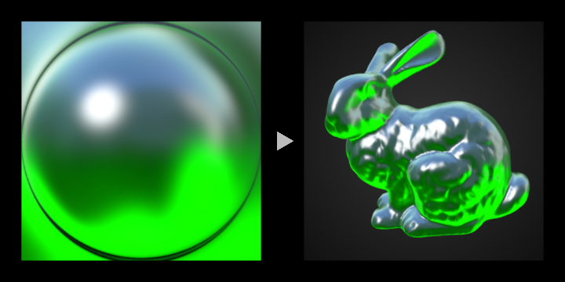
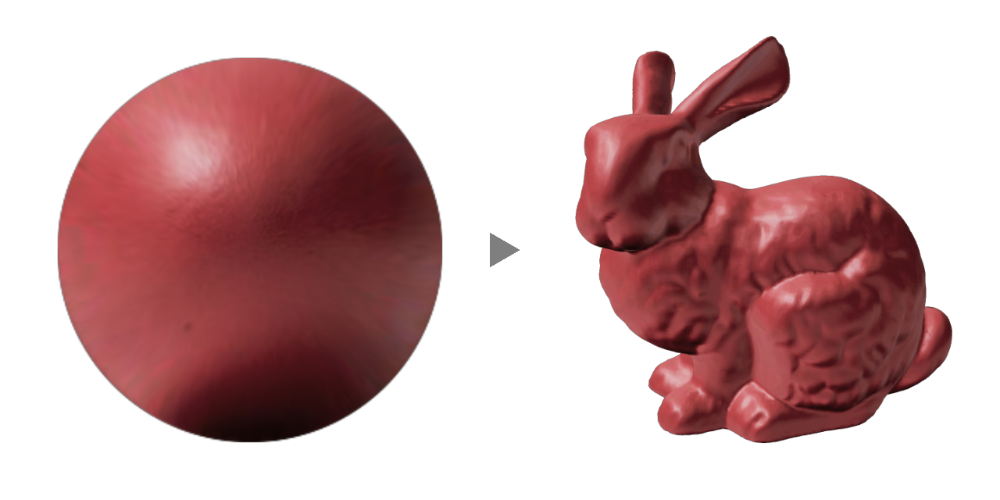
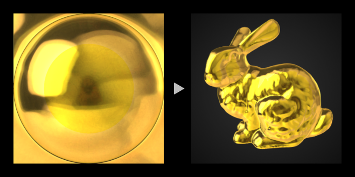
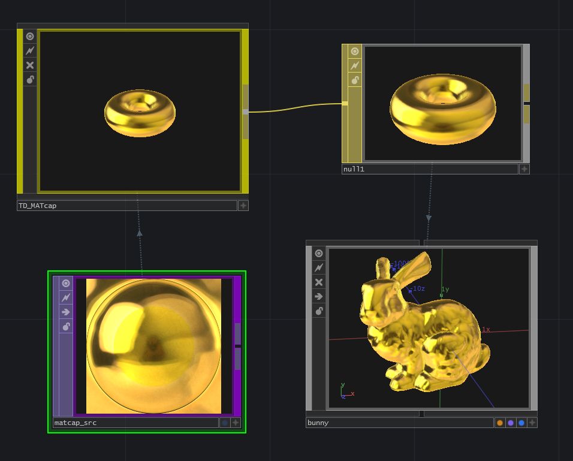

# TD-MATcap

Simple implementation of matcap in TouchDesigner.

matcap PNG textures from [nidorx/matcaps](https://github.com/nidorx/matcaps)

---
Yea Chen (yeataro)

https://github.com/yeataro
yeataro@gmail.com

License : MIT license