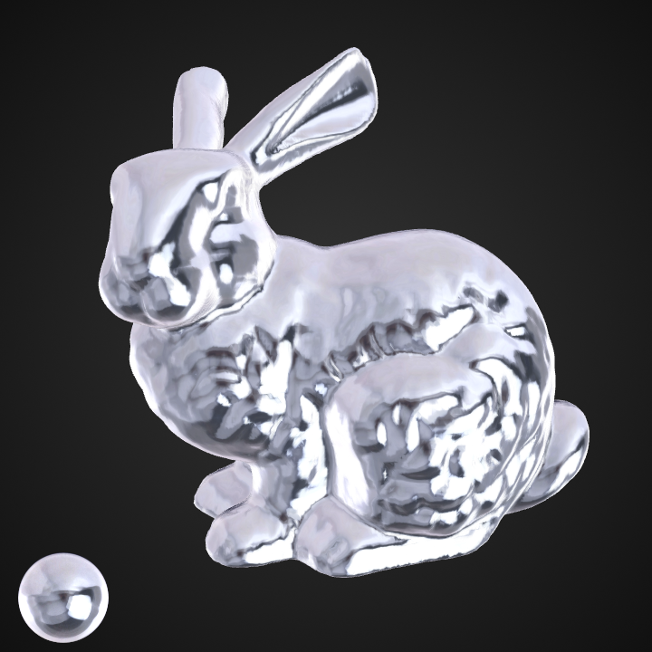
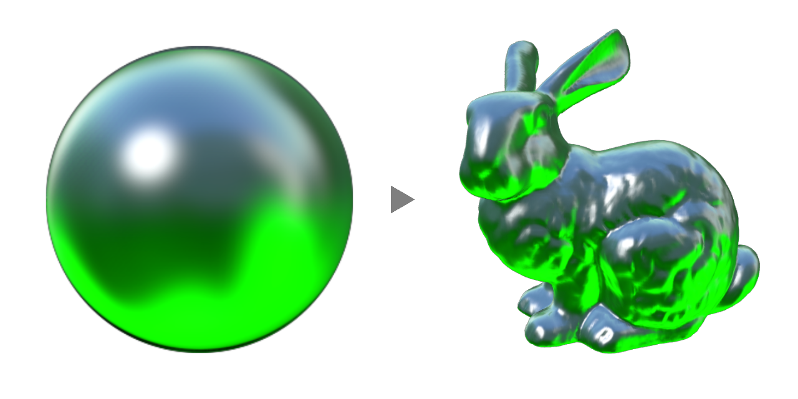
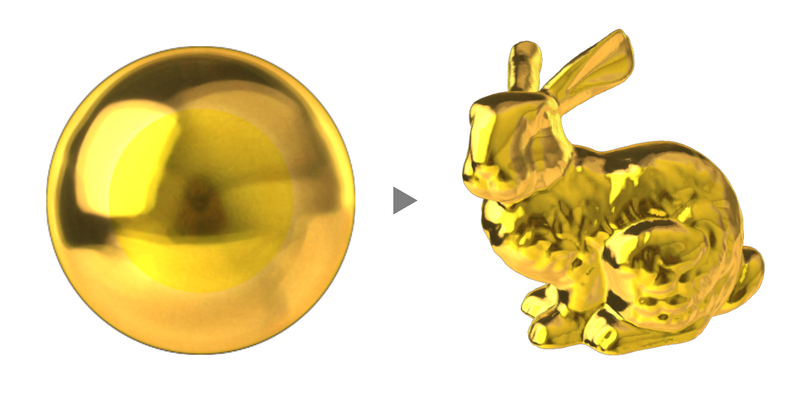

# TD-MATcap

Simple implementation of [MatCap](https://github.com/nidorx/matcaps#what-is-matcap) in TouchDesigner.

MatCap PNG textures from : [nidorx/matcaps](https://github.com/nidorx/matcaps)

---
Yea Chen (yeataro)

https://github.com/yeataro/TD-MATcap

yeataro@gmail.com

License : [MIT license](LICENCE)
